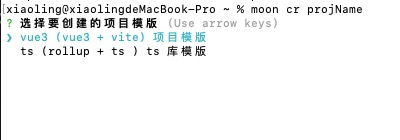

# moon-cli

通用 cli 脚手架

脚手架模版地址: <https://github.com/virtueDe/moon-cli>

# 使用

## 安装

```js
npm install -g @v50/moon-cli
```

## 使用

```js
moon cr <project-name>
```



<!-- ```js
npm init --scope=<your_org_name> // npm init --scope=v50

npm publish --access public
``` -->

<!-- ## Why is the name of the organization v50？

起因来源于肯德基的疯狂星期四，群里各种段子满天飞，但是最后一句话都是V我50吃kfc -->
